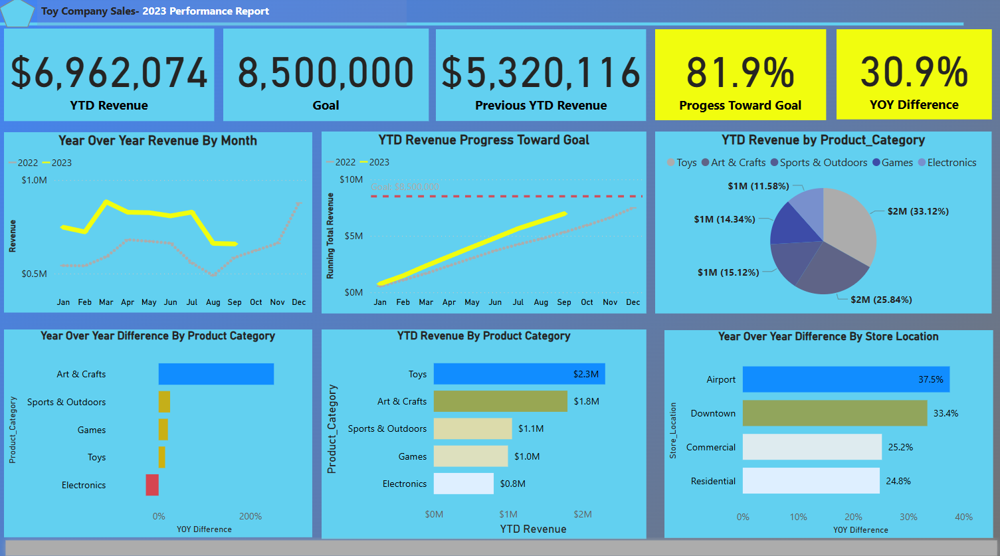
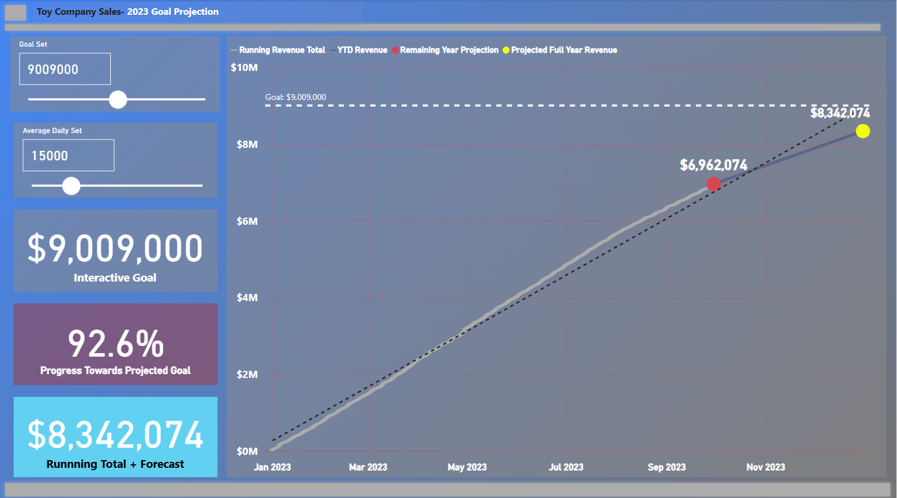
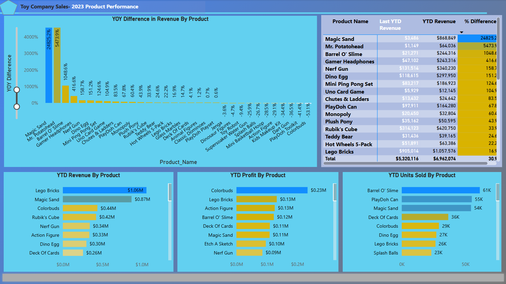
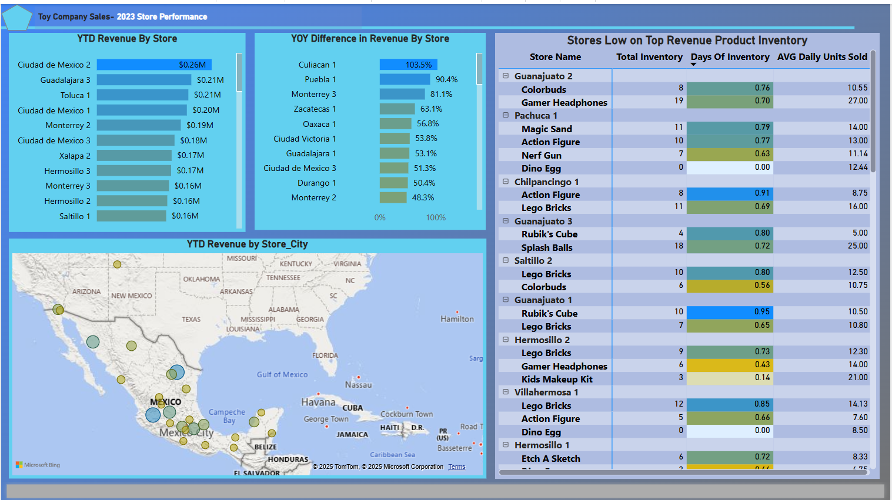
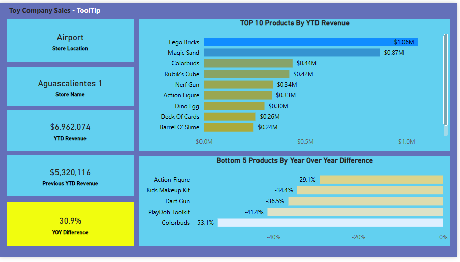

# Etl_powerBi_project_02
- This project utilizes ETL processes to analyze sales data, aiming to identify sales performance for products and stores, revenue trends, key performance indicators (KPIs), and revenue goal projections.

## Requirements
- Power Bi tool installed.

## Installation
- Download the repository here.

## Images

